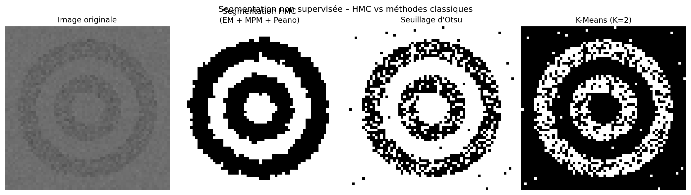
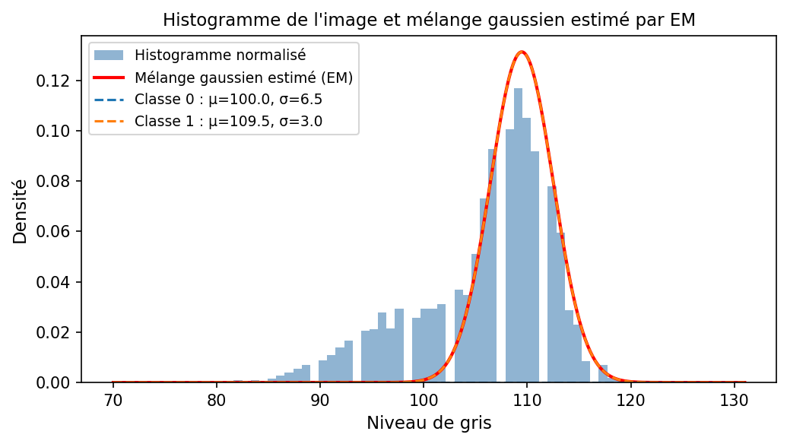
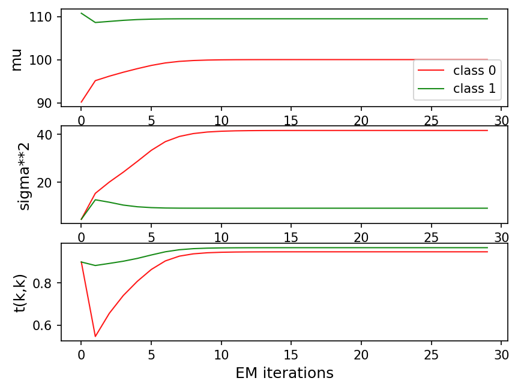
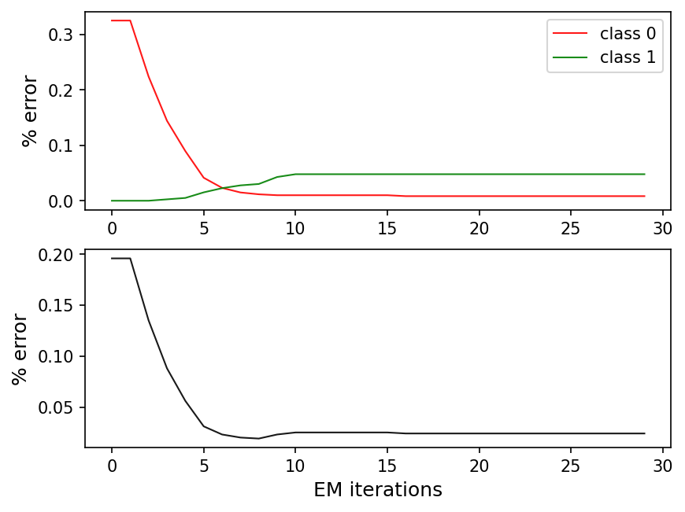

# Compte-Rendu – TP Apprentissage Bayésien et Chaîne de Markov Cachée

**Nom :** LOKE Bamishola Aristide  
**Cours :** Technologies du Big Data – MSO 3.4 – Séance #4  
**Date :** Mars 2026  

---

## 1. Introduction

L'objectif de ce TP est d'implémenter les algorithmes du modèle des **Chaînes de Markov Cachées** (Hidden Markov Chain, HMC) et de les appliquer à la **segmentation non supervisée d'une image**. La démarche repose sur deux piliers :

- L'algorithme **EM** (Expectation-Maximization) pour apprendre automatiquement les paramètres du modèle (moyennes, variances des gaussiennes, matrice de transition).
- Le critère de décision **MPM** (Maximum de Probabilité Marginale a Posteriori) pour classer chaque pixel.

Le passage d'une image 2D à un signal 1D exploitable par le HMC est réalisé via le **parcours de Peano (courbe de Hilbert)**, qui préserve au mieux le voisinage spatial des pixels.

---

## 2. Algorithmes implémentés

### 2.1 Algorithme Backward (`getBeta`)

L'algorithme **forward** (`getAlpha`) calcule, pour chaque instant $n$ et chaque état $k$, la probabilité jointe $\alpha_n(k) = P(Y_0, \ldots, Y_n, X_n = k)$ (normalisée). L'algorithme **backward** calcule de manière symétrique :

$$\beta_n(k) = P(Y_{n+1}, \ldots, Y_{N-1} \mid X_n = k)$$

**Initialisation :** $\beta_{N-1}(k) = 1$ pour tout $k$ (pas d'observations futures au dernier instant).

**Récurrence** (de $n = N-2$ jusqu'à $0$) :

$$\beta_n(k) = \sum_{l=1}^{K} t_{kl} \cdot p(Y_{n+1} \mid X_{n+1} = l) \cdot \beta_{n+1}(l)$$

où $t_{kl}$ est la probabilité de transition de l'état $k$ vers l'état $l$, et $p(Y_{n+1} \mid X_{n+1} = l) = \mathcal{N}(Y_{n+1} ; \mu_l, \sigma_l^2)$.

Pour éviter les **underflows numériques**, on divise $\beta_n$ par le facteur de normalisation $S_{n+1}$ calculé lors de la passe forward.

### 2.2 Probabilités marginales a posteriori (`getGamma`)

Une fois $\alpha$ et $\beta$ calculés, la **probabilité marginale a posteriori** de chaque état $k$ à l'instant $n$ est :

$$\gamma_n(k) = P(X_n = k \mid Y_0, \ldots, Y_{N-1}) \propto \alpha_n(k) \cdot \beta_n(k)$$

On normalise chaque vecteur $\gamma_n$ pour que $\sum_k \gamma_n(k) = 1$.

La classification **MPM** consiste alors à prendre, pour chaque $n$, l'état qui maximise $\gamma_n(k)$ :

$$\hat{X}_n^{\text{MPM}} = \arg\max_k \; \gamma_n(k)$$

### 2.3 Mise à jour des paramètres – Étape M de l'EM (`UpdateParameters`)

L'algorithme EM alterne entre une étape **E** (calcul de $\gamma$ et $\tilde{c}$) et une étape **M** (mise à jour des paramètres). Les formules de mise à jour sont :

**Moyennes :**
$$\mu_k^{\text{new}} = \frac{\sum_{n=0}^{N-1} \gamma_n(k) \, Y_n}{\sum_{n=0}^{N-1} \gamma_n(k)}$$

**Variances :**
$$\sigma_k^{2\,\text{new}} = \frac{\sum_{n=0}^{N-1} \gamma_n(k) \, (Y_n - \mu_k^{\text{new}})^2}{\sum_{n=0}^{N-1} \gamma_n(k)}$$

**Loi jointe (matrice de transition non normalisée) :**
$$c_{kl} = \sum_{n=0}^{N-2} \tilde{c}_n(k, l)$$

où $\tilde{c}_n(k,l) = P(X_n=k, X_{n+1}=l \mid Y_0,\ldots,Y_{N-1})$ est calculé via `getCtilde`.

**Matrice de transition :**
$$t_{kl}^{\text{new}} = \frac{c_{kl}}{\sum_{l'} c_{kl'}}$$

**Loi initiale :**
$$I_k^{\text{new}} = \gamma_0(k)$$

---

## 3. Résultats de segmentation d'image

### 3.1 Image utilisée

L'image traitée est **`cible_64_bruit.png`** (64×64 pixels, niveaux de gris), fournie avec le TP. Elle représente une cible circulaire bruitée sur fond uniforme, ce qui en fait un cas idéal pour valider la segmentation en 2 classes : fond et cible.

*Figure 1 – De gauche à droite : image originale, segmentation par HMC (EM + MPM + Peano), seuillage d'Otsu, K-Means (K=2).*

### 3.2 Histogramme et mélange gaussien estimé

*Figure 2 – Histogramme normalisé de l'image et mélange gaussien estimé par l'algorithme EM après convergence.*

L'histogramme montre **deux modes distincts** correspondant aux deux classes :
- **Classe 0 (fond) :** $\mu_0 \approx 100.0$, $\sigma_0 \approx 6.5$
- **Classe 1 (cible) :** $\mu_1 \approx 109.5$, $\sigma_1 \approx 3.0$

Les deux distributions se chevauchent (les moyennes sont proches avec seulement ~9 niveaux de gris d'écart), ce qui rend la segmentation difficile pour des méthodes sans contexte spatial. On remarque également que la classe 0 a une variance plus grande ($\sigma_0 \approx 6.5$) que la classe 1 ($\sigma_1 \approx 3.0$), ce qui traduit une plus grande hétérogénéité du fond.

### 3.3 Courbes de convergence EM

*Figure 3 – Évolution des paramètres estimés ($\mu$, $\sigma^2$, $t_{kk}$) au fil des itérations EM.*

On observe trois comportements distincts :

- **Moyennes ($\mu$)** : les deux classes convergent rapidement (~5 itérations) vers des valeurs stables ($\mu_0 \approx 100$, $\mu_1 \approx 109$). La classe 1 (vert) est très stable dès le départ car ses paramètres initiaux étaient déjà proches de la vérité.
- **Variances ($\sigma^2$)** : la variance de la classe 0 (rouge) monte fortement avant de se stabiliser (~40), tandis que celle de la classe 1 se stabilise rapidement (~10). Cela est cohérent avec la plus grande dispersion du fond.
- **Probabilités de transition ($t_{kk}$)** : après une perturbation initiale (la classe 0 descend jusqu'à ~0.6 à l'itération 1), les deux classes convergent vers $t_{kk} \approx 0.95$, indiquant une forte persistance spatiale — les régions sont homogènes et les transitions entre classes sont rares.

*Figure 4 – Évolution du taux d'erreur par classe et global au fil des itérations EM (sur le signal simulé XY).*

Sur le signal simulé, l'erreur globale chute de **~27% à ~2%** en moins de 10 itérations, ce qui confirme la bonne convergence de l'algorithme EM.

### 3.4 Interprétation des résultats de segmentation

**La segmentation HMC est-elle bonne ?**

En observant la Figure 1, la segmentation HMC détecte correctement la structure circulaire de la cible. Les résultats sont **globalement satisfaisants** mais imparfaits, ce qui s'explique par plusieurs facteurs :

**Points forts :**
- La forme annulaire de la cible est reconnaissable dans le résultat HMC.
- Grâce à la chaîne de Markov, chaque pixel est classé en tenant compte de ses voisins (au sens du parcours de Peano), ce qui réduit le bruit de classification par rapport à Otsu.

**Limites observées :**
- La segmentation HMC présente des **irrégularités aux contours** de la cible. Cela s'explique par le fait que le parcours de Peano n'est qu'une approximation du voisinage 2D réel : certains pixels proches spatialement se retrouvent éloignés dans le vecteur 1D, et la structure markovienne ne capture donc pas parfaitement la continuité spatiale.
- Les deux classes ont des niveaux de gris très proches ($\mu_0 \approx 100$ vs $\mu_1 \approx 109$, soit seulement 9 niveaux d'écart sur une plage de 256), ce qui crée une zone d'ambiguïté importante où les deux gaussiennes se chevauchent.

**Comparaison avec Otsu et K-Means :**
- **Seuillage d'Otsu** : méthode purement globale sans contexte spatial. Le résultat est très bruité avec de nombreux pixels isolés mal classés, surtout dans les zones de transition.
- **K-Means** : également sans contexte spatial, mais produit des régions visuellement plus propres qu'Otsu sur cette image. Cependant, comme Otsu, il ignore complètement la structure spatiale.
- **HMC** : l'avantage du modèle markovien est visible — les régions sont **plus continues et moins fragmentées** qu'Otsu, bien que K-Means donne un résultat visuellement similaire ici. L'avantage du HMC serait plus marqué sur des images avec un bruit plus fort.

---

## 4. Conclusion

Ce TP a permis d'implémenter les algorithmes centraux du modèle HMC :

- L'algorithme **backward** (symétrique au forward) pour calculer les probabilités $\beta_n(k)$, en remontant la séquence depuis le dernier instant.
- Le calcul des **probabilités marginales a posteriori** $\gamma_n(k)$ par produit terme à terme de $\alpha$ et $\beta$, utilisées pour la décision MPM.
- L'étape **M de l'EM** pour la mise à jour automatique de tous les paramètres du modèle (µ, σ², matrice de transition, loi initiale) à partir des statistiques suffisantes $\gamma$ et $\tilde{c}$.

L'application à la segmentation d'image via le **parcours de Peano** montre que le modèle HMC produit une segmentation spatialement plus cohérente que les méthodes sans contexte (Otsu). La principale limite reste l'approximation introduite par la linéarisation 2D→1D, qui ne peut pas capturer parfaitement toutes les relations de voisinage d'une image.