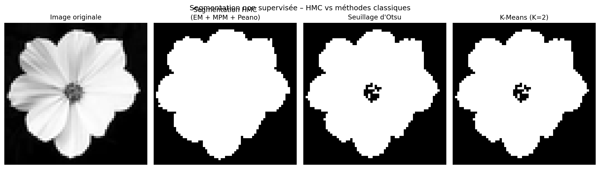
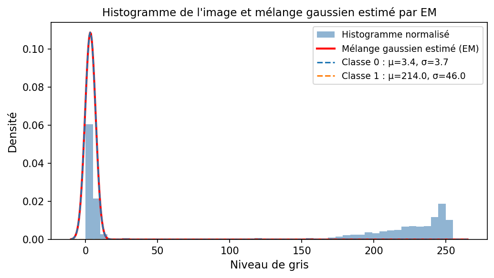
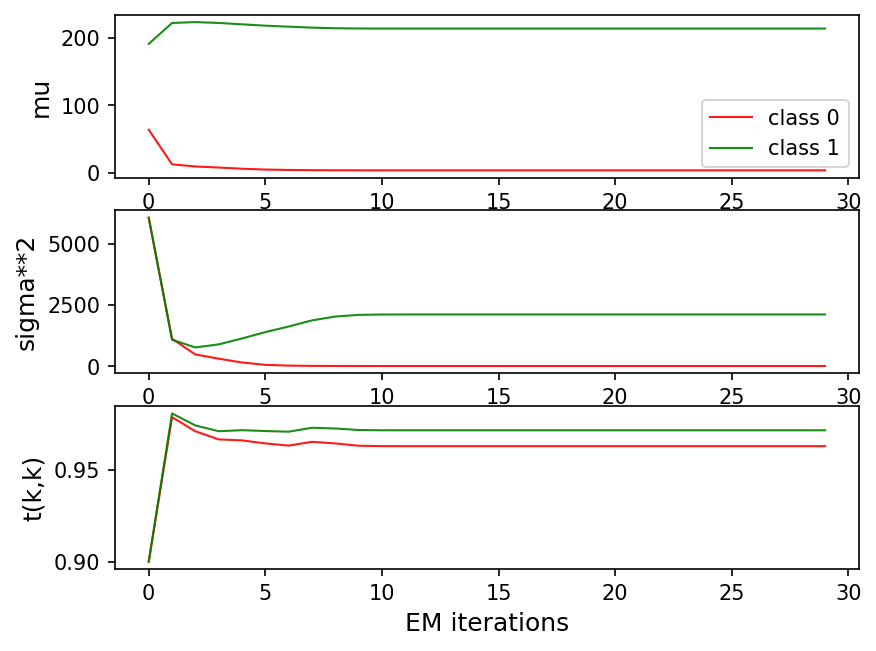

# Compte-Rendu – TP Apprentissage Bayésien et Chaîne de Markov Cachée

**Nom :** LOKE Bamishola Aristide  

---

## 1. Introduction

L'objectif de ce TP est d'implémenter les algorithmes du modèle des **Chaînes de Markov Cachées** (Hidden Markov Chain, HMC) et de les appliquer à la **segmentation non supervisée d'une image**. La démarche repose sur deux piliers :

- L'algorithme **EM** (Expectation-Maximization) pour apprendre automatiquement les paramètres du modèle (moyennes, variances des gaussiennes, matrice de transition).
- Le critère de décision **MPM** (Maximum de Probabilité Marginale a Posteriori) pour classer chaque pixel.

Le passage d'une image 2D à un signal 1D exploitable par le HMC est réalisé via le **parcours de Peano (courbe de Hilbert)**, qui préserve au mieux le voisinage spatial des pixels.

---

## 2. Algorithmes implémentés

### 2.1 Algorithme Backward (`getBeta`)

L'algorithme **forward** (`getAlpha`) calcule, pour chaque instant $n$ et chaque état $k$, la probabilité jointe $\alpha_n(k) = P(Y_0, \ldots, Y_n, X_n = k)$ (normalisée). L'algorithme **backward** calcule de manière symétrique :

$$\beta_n(k) = P(Y_{n+1}, \ldots, Y_{N-1} \mid X_n = k)$$

**Initialisation :** $\beta_{N-1}(k) = 1$ pour tout $k$ (pas d'observations futures au dernier instant).

**Récurrence** (de $n = N-2$ jusqu'à $0$) :

$$\beta_n(k) = \sum_{l=1}^{K} t_{kl} \cdot p(Y_{n+1} \mid X_{n+1} = l) \cdot \beta_{n+1}(l)$$

où $t_{kl}$ est la probabilité de transition de l'état $k$ vers l'état $l$, et $p(Y_{n+1} \mid X_{n+1} = l) = \mathcal{N}(Y_{n+1} ; \mu_l, \sigma_l^2)$.

Pour éviter les **underflows numériques**, on divise $\beta_n$ par le facteur de normalisation $S_{n+1}$ calculé lors de la passe forward.

### 2.2 Probabilités marginales a posteriori (`getGamma`)

Une fois $\alpha$ et $\beta$ calculés, la **probabilité marginale a posteriori** de chaque état $k$ à l'instant $n$ est :

$$\gamma_n(k) = P(X_n = k \mid Y_0, \ldots, Y_{N-1}) \propto \alpha_n(k) \cdot \beta_n(k)$$

On normalise chaque vecteur $\gamma_n$ pour que $\sum_k \gamma_n(k) = 1$.

La classification **MPM** consiste alors à prendre, pour chaque $n$, l'état qui maximise $\gamma_n(k)$ :

$$\hat{X}_n^{\text{MPM}} = \arg\max_k \; \gamma_n(k)$$

### 2.3 Mise à jour des paramètres – Étape M de l'EM (`UpdateParameters`)

L'algorithme EM alterne entre une étape **E** (calcul de $\gamma$ et $\tilde{c}$) et une étape **M** (mise à jour des paramètres). Les formules de mise à jour sont :

**Moyennes :**
$$\mu_k^{\text{new}} = \frac{\sum_{n=0}^{N-1} \gamma_n(k) \, Y_n}{\sum_{n=0}^{N-1} \gamma_n(k)}$$

**Variances :**
$$\sigma_k^{2\,\text{new}} = \frac{\sum_{n=0}^{N-1} \gamma_n(k) \, (Y_n - \mu_k^{\text{new}})^2}{\sum_{n=0}^{N-1} \gamma_n(k)}$$

**Loi jointe (matrice de transition non normalisée) :**
$$c_{kl} = \sum_{n=0}^{N-2} \tilde{c}_n(k, l)$$

où $\tilde{c}_n(k,l) = P(X_n=k, X_{n+1}=l \mid Y_0,\ldots,Y_{N-1})$ est calculé via `getCtilde`.

**Matrice de transition :**
$$t_{kl}^{\text{new}} = \frac{c_{kl}}{\sum_{l'} c_{kl'}}$$

**Loi initiale :**
$$I_k^{\text{new}} = \gamma_0(k)$$

---

## 3. Résultats de segmentation d'image

### 3.1 Image utilisée

L'image traitée est **`image3_64.pgm`** (64×64 pixels, niveaux de gris), une image de fleur blanche sur fond noir. Elle présente un fort contraste entre les deux régions (fond sombre vs pétales clairs), ce qui en fait un cas très favorable pour la segmentation en 2 classes.

*Figure 1 – De gauche à droite : image originale, segmentation par HMC (EM + MPM + Peano), seuillage d'Otsu, K-Means (K=2).*

### 3.2 Histogramme et mélange gaussien estimé

*Figure 2 – Histogramme normalisé de l'image et mélange gaussien estimé par l'algorithme EM après convergence.*

L'histogramme montre **deux modes très bien séparés** correspondant aux deux classes :
- **Classe 0 (fond noir) :** $\mu_0 \approx 3.4$, $\sigma_0 \approx 3.7$
- **Classe 1 (fleur blanche) :** $\mu_1 \approx 214.0$, $\sigma_1 \approx 46.0$

Les deux distributions sont très éloignées (plus de 200 niveaux de gris d'écart), ce qui rend la séparation des classes très aisée. La classe 0 est extrêmement concentrée ($\sigma_0 \approx 3.7$, fond quasi uniforme), tandis que la classe 1 est très étalée ($\sigma_1 \approx 46.0$) car les pétales présentent de fortes variations de luminosité (veines, ombres, dégradés). On remarque que le mélange gaussien estimé (courbe rouge) modélise bien le pic gauche (fond), mais la gaussienne de la classe 1 est trop étalée pour capturer fidèlement la distribution réelle de la fleur, dont les pixels sont concentrés entre 175 et 255. Cela illustre une limite du modèle gaussien sur des distributions asymétriques.

### 3.3 Courbes de convergence EM

*Figure 3 – Évolution des paramètres estimés ($\mu$, $\sigma^2$, $t_{kk}$) au fil des itérations EM.*

On observe les comportements suivants :

- **Moyennes ($\mu$)** : la classe 0 (rouge) part de ~64 et converge rapidement vers $\mu_0 \approx 3$ (fond noir) dès la 2ème itération. La classe 1 (vert) part de ~200 et monte légèrement vers $\mu_1 \approx 214$. Les deux valeurs finales sont stables après ~5 itérations.
- **Variances ($\sigma^2$)** : les deux classes partent d'une valeur initiale très élevée (~6000), puis convergent : la variance de la classe 1 (vert) se stabilise à $\sigma^2 \approx 2400$ ($\sigma \approx 49$), reflet de la grande dispersion des niveaux de gris de la fleur. Celle de la classe 0 (rouge) descend vers ~0, cohérent avec un fond très sombre et quasi uniforme.
- **Probabilités de transition ($t_{kk}$)** : les deux classes convergent vers $t_{kk} \approx 0.97$, indiquant une très forte persistance spatiale. C'est cohérent avec une image composée de deux grandes zones homogènes (fond et fleur) avec très peu de pixels de transition.

### 3.4 Interprétation des résultats de segmentation

**La segmentation HMC est-elle bonne ?**

La segmentation HMC est **très bonne** sur cette image. La fleur est clairement isolée du fond, avec des contours bien définis et une région blanche homogène. Plusieurs facteurs expliquent ce succès :

**Points forts :**
- Le fort contraste entre fond noir ($\mu_0 \approx 3$) et fleur blanche ($\mu_1 \approx 214$) rend la séparation des classes très aisée pour l'algorithme EM, qui converge en très peu d'itérations.
- La structure markovienne favorise la cohérence spatiale : les grandes zones homogènes (fond, pétales) sont bien préservées, sans pixels isolés aberrants.
- La très forte persistance estimée ($t_{kk} \approx 0.97$) est bien adaptée à cette image où les transitions fond/fleur sont rares.

**Limites observées :**
- Le **pistil sombre** au centre de la fleur n'est pas segmenté séparément : avec K=2 classes, il est rattaché au fond. Le HMC, grâce au contexte markovien, lisse cet artefact et produit une région blanche continue sans trou au centre — ce qui est visible en comparant avec Otsu et K-Means.
- Les contours des pétales présentent quelques irrégularités en escalier, dues à la résolution de l'image (64×64) et à la linéarisation 2D→1D par le parcours de Peano.

**Comparaison avec Otsu et K-Means :**
- **Seuillage d'Otsu** : produit un résultat globalement correct mais avec un trou noir visible au centre (pistil classé comme fond) et des contours irréguliers.
- **K-Means** : résultat très similaire à Otsu, avec le même artefact au centre. Sans contexte spatial, chaque pixel est classé indépendamment de ses voisins.
- **HMC** : produit la segmentation **la plus propre et la plus homogène** des trois méthodes. La région blanche est continue sans trou, ce qui illustre concrètement l'apport du contexte markovien par rapport aux méthodes pixel-indépendantes.

---

## 4. Conclusion

Ce TP a permis d'implémenter les algorithmes centraux du modèle HMC :

- L'algorithme **backward** (symétrique au forward) pour calculer les probabilités $\beta_n(k)$, en remontant la séquence depuis le dernier instant.
- Le calcul des **probabilités marginales a posteriori** $\gamma_n(k)$ par produit terme à terme de $\alpha$ et $\beta$, utilisées pour la décision MPM.
- L'étape **M de l'EM** pour la mise à jour automatique de tous les paramètres du modèle (µ, σ², matrice de transition, loi initiale) à partir des statistiques suffisantes $\gamma$ et $\tilde{c}$.

L'application à la segmentation d'une image de fleur via le **parcours de Peano** montre que le modèle HMC produit une segmentation spatialement plus cohérente et plus propre que les méthodes sans contexte (Otsu, K-Means), en particulier sur des images avec de grandes régions homogènes. La principale limite reste l'approximation introduite par la linéarisation 2D→1D, qui ne peut pas capturer parfaitement toutes les relations de voisinage d'une image 2D.